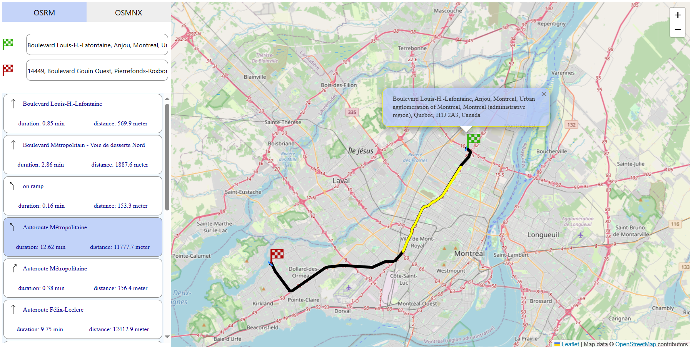

<p align="center">
  <a href="" rel="noopener">
 </a>
</p>

<br/>


# Routing Application with OSRM & OSMNX

This application provides a routing API for finding routes between origin and destination locations using both OSRM and OSMnx backends. It also includes a simple Angular frontend that allows users to select locations on a map and displays detailed route steps with arrows.

## Table of Contents
1. [Features](#features)
2. [Installation](#installation)
3. [Usage](#usage)
4. [Testing](#testing)


## Features
- **Routing API**: The application provides a robust routing API that supports both OSRM and OSMnx backends.
- **Location Selection**: Users can select origin and destination locations on a map using the simple Angular frontend.
- **Geocoding**: The app supports location-to-address and address-to-location conversions.
- **Route Visualization**: The application displays detailed route steps with arrows to help users visualize their journey.

## Installation
Before running the Routing Application, ensure that you have the following prerequisites:
- Node.js
- Python
- OSRM Backend (running and configured)
- OSMnx (Python library)

To install the application, follow these steps:
1. Clone the repository to your local machine.
2. Download the required OSM data for use with OSRM and OSMNX.
3. Install the necessary dependencies by running `npm install`.
4. Install the necessary Python dependencies by running `pip install -r requirements.txt`.

## Usage
To use the Routing Application, follow these steps:
1. Configure the application settings in the `config/default.json` and `config/test.json` files.
2. Start the OSRM backend and ensure it is running and configured correctly.
3. Start the application by running `npm start`.
4. Access the application through the specified URL or port (e.g., `http://localhost:55000`).
5. Use the simple Angular frontend to select origin and destination locations on the map.
6. Choose the desired routing type (OSMnx or OSRM) and any additional options.
7. Click on the "Calculate Route" button to generate the route and view the detailed steps with arrows.
8. Access the API endpoints:
    - `POST /routing/osmnx`
      - Body parameters:
        - `origin`: Origin coordinates (latitude, longitude)
        - `destination`: Destination coordinates (latitude, longitude)
    - `POST /routing/osrm`
      - Body parameters:
        - `origin`: Origin coordinates (latitude, longitude)
        - `destination`: Destination coordinates (latitude, longitude)
   - The API response will contain the calculated route, travel distance, and travel time.

Please ensure that the OSRM backend is running and accessible when using the `osrm` routing type.

## Testing

The application includes test cases that can be run using Jest. To run the tests, execute the command `npm test`. This will run all the defined test cases and provide the test results.

To test the availability of OSRM and OSMnx services, you can set the following environment variables in a `.env` file:

```plaintext
NODE_ENV=development
OSRM_SERVICE=true/false
OSMNX_SERVICE=true/false
